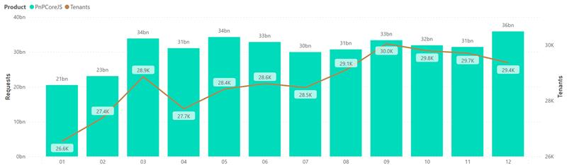

# 2022 Year End Report

Wow, what a year for [PnPjs](https://github.com/pnp/pnpjs)! We released our latest major version 3.0 on Valentine's Day 2022 which included significant performance improvements, a completely rewritten internal architecture, and reduced the bundled library size by two-thirds. As well we continued out monthly releases bringing enhancements and bug fixes to our users on a continual basis.

But before we go any further we once again say **Thank You!!!** to everyone that has used, contributed to, and provided feedback on the library. This journey is not possible without you, and this last year you have driven us to be our best.

Version 3 introduces a completely new design for the internals of the library, easily allowing consumers to customize any part of the request process to their needs. Centered around an extensible [Timeline](https://github.com/pnp/pnpjs/blob/version-3/packages/core/timeline.ts#L126) and extended for http requests by [Queryable](https://github.com/pnp/pnpjs/blob/version-3/packages/queryable/queryable.ts#L34) this new pattern reduced code duplication, interlock, and complexity significantly. It allows everything in the request flow to be controlled through [behaviors](https://pnp.github.io/pnpjs/core/behaviors/), which are plain functions acting at the various stages of the request. Using this model we reimagined batching, caching, authentication, and parsing in simpler, composable ways. If you have not yet updated to version 3, we encourage you to do so. You can review the [transition guide](https://pnp.github.io/pnpjs/transition-guide/) to get started.

As one last treat, we set up nightly builds so that each day you can get a fresh version with any updates merged the previous day. This is super helpful if you're waiting for a specific fix or feature for your project. It allows for easier testing of new features through the full dev lifecycle, as well.

In other news, we fixed 54 reported bugs, answered 123 questions, and made 54 suggested enhancements to version 3 of the library - all driven by feedback from users and the community.

## Usage

In 2022 we continued to see steady usage and growth maintaining a requst/month rate over 30 billion for much of the year. These requets came from ~29K tenants a month, including some of our largest M365 customers.

## Releases

We continued our monthly release cadence as it represents a good pace for addressing issues while not expecting folks to update too often and keeping each update to a reasonable size. All changes can be tracked in our [change log](https://github.com/pnp/pnpjs/blob/main/CHANGELOG.md), updated with each release. You can check our scheduled releases through [project milestones](https://github.com/pnp/pnpjs/milestones), understanding there are occasionally delays. Monthly releases allows us to ensure bugs do not linger and we continually improve and expand the capabilities of the libraries.

### NPM Package download statistics (@pnp/sp)

| Month    | Count   | *   | Month       | Count  |
| -------- | ------- | --- | ----------- | ------ |
| January  | 70,863  | *   | July        | 63,844 |
| February | 76,649  | *   | August      | 75,713 |
| March    | 83,902  | *   | September   | 71,447 |
| April    | 70,429  | *   | October     | 84,744 |
| May      | 72,406  | *   | November    | 82,459 |
| June     | 71,375  | *   | December    | 65,785 |
|          |         |     |             |        |
|          |         |     | Grand Total | 889,616|

For comparison our total downloads in 2021 was 793,747.

With 2022 our total all time downloads of @pnp/sp is now at: 2,543,639

In 2021 the all time total was 1,743,385.

> Stats from <https://npm-stat.com/>

## Future Plans

Looking to the future we will continue to actively grow and improve v3 of the library, guided by feedback and reported issues. Additionally, we are looking to expand our contributions documentation to make it easier for community members to contibute their ideas and updates to the library.

## Contributors

As always we have abundant thanks and appreciation for your contributors. Taking your time to help improve PnPjs for the community is massive and valuable to ensure our sustainability. Thank you for all your help in 2021! If you are interested in becoming a contributor [check out our guide](../contributing/index.md) on ways to get started.

## Sponsors

We want to thank our sponsors for their support in 2020! This year we put the money towards helping offset the cost and shipping of hoodies to contributors and sponsors. Your continued generosity makes a big difference in our ability to recognize and reward the folks building PnPjs.

**Thank You**

## Closing

In closing we want say _Thank You_ to everyone who uses, contributes to, and participates in PnPjs and the SharePoint Patterns and Practices program.

Wishing you the very best for 2023,

The PnPjs Team
